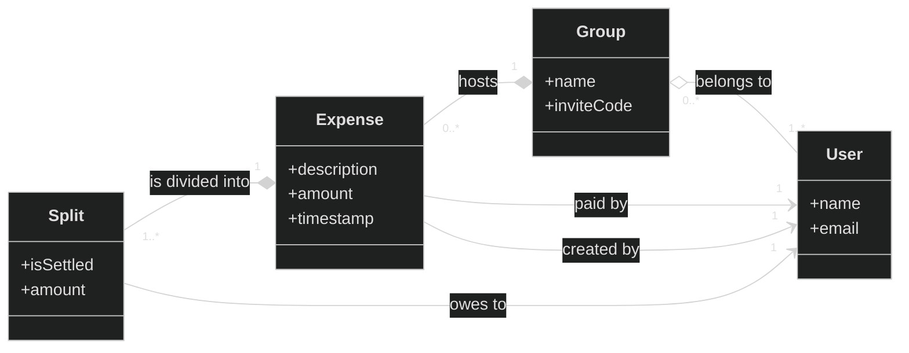
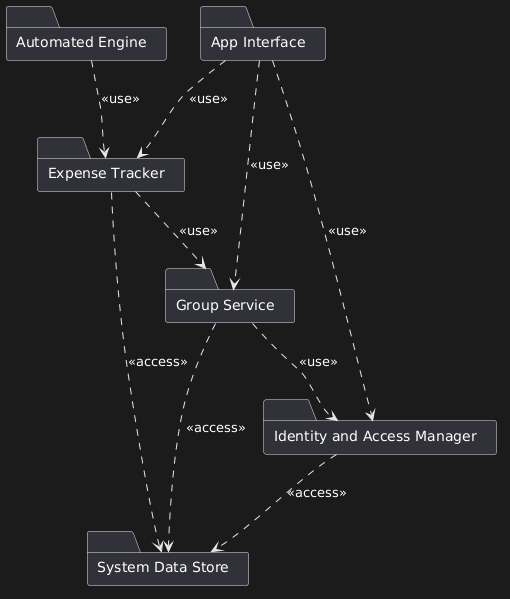
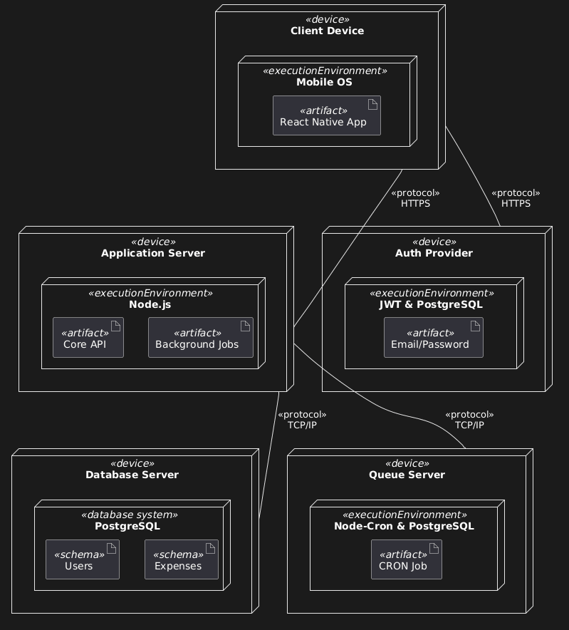
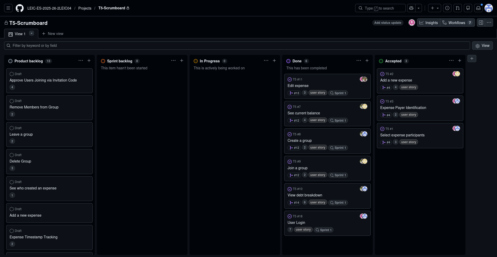
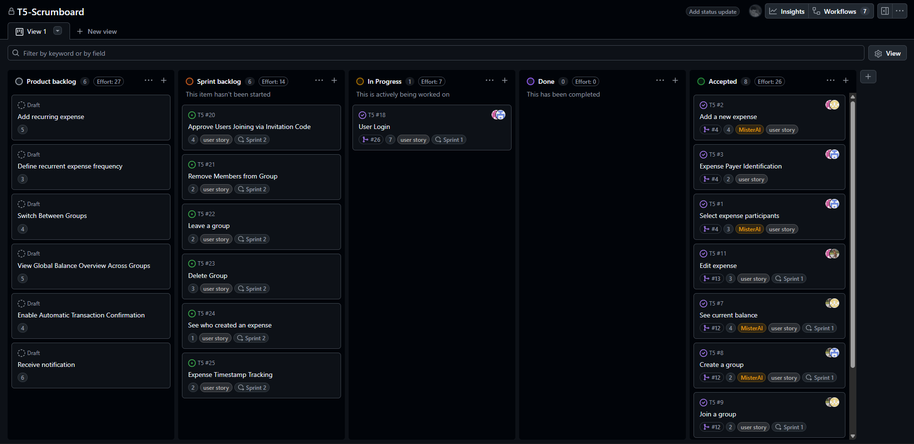
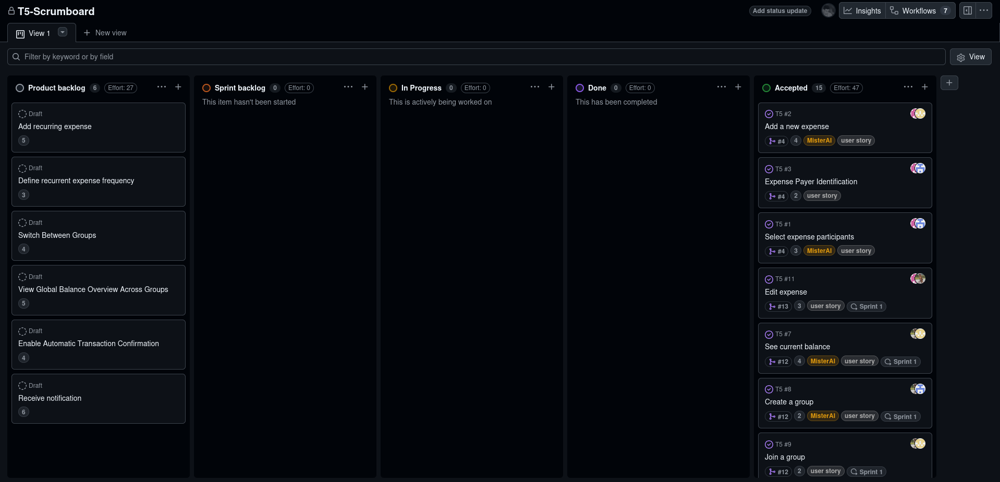

# SmartSplit Development Report

Welcome to the documentation of **SmartSplit**!

This Software Development Report, tailored for LEIC-ES-2025-26, provides comprehensive details about **SmartSplit**, starting from an high-level vision and going into low-level implementation decisions.

It is organised by the following activities:

* [Business modeling](#Business-Modelling) 
  * [Product Vision](#Product-Vision)
  * [Features and Assumptions](#Features-and-Assumptions)
* [Requirements](#Requirements)
  * [User stories](#User-stories)
  * [Domain model](#Domain-model)
  * [User interfaces](#User-interfaces)
* [Architecture and Design](#Architecture-And-Design)
  * [Logical architecture](#Logical-Architecture)
  * [Physical architecture](#Physical-Architecture)
  * [Functional prototype](#Functional-Prototype)
* [Development Environment](#Development-Environment)
  * [How to setup development environment](#How-to-setup-development-environment)
  * [Tools and prompts used](#Tools-and-prompts-used)
* [Project management](#Project-Management)
  * [Sprint 0](#Sprint-0)
  * [Sprint 1](#Sprint-1)
  * [Sprint 2](#Sprint-2)
  * [Sprint 3](#Sprint-3)
  * [Final Release](#Final-Release)

Contributions are expected to be made exclusively by the initial team, but we may open them to the community, after the course, in all areas and topics: requirements, technologies, development, experimentation, testing, etc.

Please contact us!

Thank you!

* **Aléxis Ramos** - up202404977@up.pt
* **Luís Kong** - up202409115@up.pt
* **Luís Guimarães** - up202403752@up.pt
* **Clara Correia** - up202404979@up.pt
* **Kleiton Soares** - up202409108@up.pt

---

## Business Modelling

Business modeling in software development involves defining the product's vision, understanding market needs, aligning features with user expectations, and setting the groundwork for strategic planning and execution.

### Product Vision

  Our target with this app is erasing any financial friction between people living in the same space and preserving friendships at the same time. We know that finances are one of the leading causes of tension among roommates, resentment can easily build over forgotten grocery runs, unequal utility bills, or even the awkwardness of constantly asking someone to pay you back.

  So we believe that tracking shared expenses all the way from a late-night pizza run to monthly Wi-Fi bills, for example, should be transparent, automated, and stress-free. Well organized expense tracking shouldn't need a degree in accounting or a complex, color-coded spreadsheet. That's where our application comes in, it acts as a neutral, automated financial mediator, so roommates can forget arguing over spreadsheets and loose receipts and only need to enter the app from time to time and check if the are owing money to any of their living partners.

### Features and Assumptions

* **Expense Creation and Recording:** Users can quickly add shared expenses such as groceries, rent, utilities, or household purchases. Each expense includes details such as the payer, amount, description, category, and which roommates participated in the expense.

* **Automated Expense Splitting:** Instantly divide shared expenses among roommates without manual calculations. The system automatically determines how much each person owes based on the selected split configuration.

* **Equal and Custom Splits:** Expenses can be divided equally among all roommates or using custom percentage distributions depending on the living arrangement.

* **Custom Percentage Configuration:** Users can define fixed percentage contributions for recurring expenses such as rent or utilities (e.g., one roommate pays a higher share for a larger bedroom).

* **Selective Expense Participation:** Users can select which roommates are involved in a particular expense, allowing accurate tracking when not everyone participates in the same purchase.

* **Recurring Expense Management:** Automatically log recurring expenses such as rent, internet, electricity, or streaming subscriptions on a weekly or monthly schedule.

* **Real-Time Balance Tracking:** The system continuously updates balances whenever expenses or payments are added, allowing roommates to instantly see who owes money and who should receive it.

* **Smart Debt Simplification ("Who Owes Who"):** An algorithm calculates the most efficient way to settle debts, minimizing the number of transactions needed between roommates.

* **Settlement Tracking:** Users can mark payments as completed when debts are settled outside the app (e.g., bank transfer, MBWay, PayPal, or cash).

* **Expense Editing and Corrections:** Users can modify or remove expenses if mistakes are made, with balances automatically recalculated to reflect the changes.

* **Expense History and Activity Log:** The application keeps a complete history of all recorded expenses, payments, and modifications, ensuring transparency between roommates.

* **Expense Categories:** Expenses can be categorized (e.g., groceries, rent, utilities, entertainment, household items) to help users better understand shared spending patterns.

* **Dashboard Overview:** A clear dashboard summarizes current balances, recent expenses, and outstanding debts so roommates can quickly understand the household’s financial situation.

* **Roommate Group Management:** Users can create or join a shared household group where all roommates participate and track expenses together.

* **User Accounts and Authentication:** Each roommate has a secure personal account to access their shared household group and manage expenses.

* **Notifications and Reminders:** The system can notify users when new expenses are added, when balances change, or when payments are pending.

* **Data Persistence and Synchronization:** All expenses and balances are securely stored and synchronized so every roommate sees the most up-to-date information.

* **Cross-Platform Accessibility:** The application is designed to run on modern smartphones, allowing roommates to manage expenses conveniently from their devices.

### Assumptions

* Household harmony: roommates agree on the predefined split percentages and recurring schedules established within a shared "House" group.
* Single Currency: all users within a specific group operate using the same currency.
* Basic Categorization: have a predefined set of categories or icons, for users to have a basic breakdown of where their money is going (e.g., Rent, Utilities, Groceries, Drinks).
* Honor System: Because the app doesn't verify bank balances, you assume users trust one another. Settling a debt relies entirely on one user tapping "Mark as Paid" and the other acknowledging that the money was actually received.
* Wi-fi access: users have access to wi-fi.

### Dependencies
* The application depends on the React Native framework for cross-platform mobile development.

---

## Requirements

### Domain model

The SmartSplit domain focuses on the relationship between **Users**, **Groups**, and **Expenses**. A `Group` consists of multiple `Users`. An `Expense` is created within a `Group`, paid by one `User`, and split among several `Participants` (Users) according to a `SplitLogic`.

* **User:** Represents an individual with an account.
* **Group:** A shared household entity containing members.
* **Expense:** A financial record containing amount, date, and category.
* **Split:** The logic defining how an expense is distributed (Equal, Percentage).

#### Logical Diagram

---

## Architecture and Design

### Logical architecture

We divided the logic into four distinct components/services, aiming to keep the system organized and scalable, which are the following:

 1. Identity and Access Manager (IAM): This works has a handler for the user sessions and permissions,. It knows who is an Admin, who is a regular member, and also handles Logins or Registrations.
 2. Group Service: This service manages the lifecycle and boundaries of a group. It handles "Join/Leave/Delete Group" requests, generates invitation codes, and maintains the list of members that belong to each group.
 3. Expense Tracker: The financial core. It processes the "Add new expense", records the "Expense Payer", tracks the "Creator", logs the "Timestamp", and needs to calculate the debts each user has.
 4. Automation Engine: The background worker. It strictly handles the "Recurring expense", "Frequency rules", and "Automatic Confirmation" stories.

The components interact with each other during key user actions following these relationships:

 - Scenario 1: Managing Group Access (Ex.: Joining a group, Approve via Code, Remove Members, Delete Group)
A user submits an Invitation Code to the Group Service.
The Group Service validates the code and flags the request as "Pending".
The Identity and Access Manager notifies the Group Admin. Once the Admin approves, it then tells the Group Service that the user can be added.
If an Admin deletes the group, the Group Service removes the group and tells the IAM to revoke all access.

- Scenario 2: Processing a Standard Expense (Ex.: Add expense, Select participants, Payer ID, See creator, Timestamp Tracking)
A user submits an expense. The IAM instantly attaches their ID as the "Creator" and logs the exact "Timestamp".
The Expense Tracker receives the request and cross-checks with the Group Service to ensure the "Payer" and all selected "Participants" actually belong to that specific group.
Once verified, the Expense Tracker, updates the financial balances for everyone involved, and saves the transaction.

- Scenario 3: Triggering Automations (Ex.: Add recurring, Define frequency, Auto-confirm)
A user sets up a $50 monthly internet bill. The Tracker tells the Automation Engine to save this rule ("Frequency: Monthly").
The Automation Engine runs quietly in the background. When the 1st of the month hits, it pings the Tracker and says, "Execute the $50 internet bill now."
Because the user enabled "Automatic Transaction Confirmation," the Tracker skips the pending state, instantly posts the expense, and updates the group's balances without requiring manual approval.

#### Package Diagram

### Physical architecture

#### 1. Group Admin (Access & Identity)
   - A Role-Based Access Control (RBAC) service. When a user creates a group, they are assigned an "Admin" role in the database. Invitation codes are generated and temporarily cached.
   - The goal is to achieve security and state management. We need a strict boundary so only Admins can approve joins, remove members, or delete the group. Caching the invite codes prevents unnecessary database hits.

#### 2. Core Expenses (Transactional Data)
   - For the transactions we are going with a relational data model using strict ACID (Atomicity, Consistency, Isolation, Durability) database transactions. Every expense creation ties a Creator ID, Payer ID, and multiple Participant IDs to a single Timestamped Tracker entry.
   - It's important we follow this model because money requires absolute precision. If a user adds an expense, the database must guarantee that the payer's balance increases and the participants' balances decrease simultaneously. If one part fails, the whole transaction must roll back.

#### 3. Automation (Background Processing)
   - Mainly for the recurring expenses, for now, a distributed task queue and a CRON scheduler completely separated from the main API server is what we are using.
   - This aproach is good performance wise. If an API endpoint was responsible for checking and creating 10,000 recurring expenses at midnight, the app would crash or slow down for active users. Offloading this to a background worker ensures the app stays fast while transactions auto-confirm in the background.

#### The technologies implemented for this project where the following:

- Frontend: React Native with Expo platform, group apps only work if everyone can use them, regardless of their phone. This framework lets us build iOS and Android apps from a single codebase, also using the Expo platform on it enables a drastic speed up in development.

- Database: Firebase, whe choose NoSQL because for financial Trackers it's fairly simpler to create and manage like this, and the Firebase choice was because it's a very solid choice and also can be used for the authentication, thus not needing to introduce more unnecessary complication, even though we've worked with SQLite before in the course, we learned it had some flawed features and ambiguity while also having unexpected behaviour with some queries.

- Backend / API: Node.js: Again it's a solid and well documented language, besides that it's highly scalable and excellent at handling thousands of concurrent I/O operations (like users constantly syncing group balances).

- Background Jobs (Automation): For monthly recurring expenses, whe are using a simple CRON job running inside a Node.js process, that's going to use the node-cron, also creating a table in the database.

- Authentication: Using Firebase, the same technology we used for the database, we built an authentication logic, so when a user sends email/password, we can register or verify if the user already exists, logging user in.

- Testing: We have used Maestro to produce automated unit and integration tests following the user acceptance tests we envisioned.

#### Deployment Diagram

### Functional prototype

---

## Development Environment

### How to setup development environment

For this project we used React Native with a framework called Expo, for that it's needed to install the following dependencies: Node.js, OpenJDK, Android Studio. Then configure Android Studio like the React Native guide suggests (https://reactnative.dev/docs/environment-setup), after that setup the only step needed is to open any IDE or the terminal in the project's directory and run "npx expo start".

### Tools and prompts used

During development we used AI assistance mainly to speed up implementation, testing, and documentation tasks. The AI output was reviewed and validated by the team before being kept in the repository.

#### AI tools used

- OpenAI ChatGPT / Codex: used as a coding assistant to inspect the repository, suggest implementation changes, rewrite tests, and prepare documentation text.
- Git and GitHub: used together with the AI assistant to inspect branches, review diffs, commit changes, and push updates to the remote repository.
- Jest and React Native Testing Library: used to validate AI-assisted test changes locally.
- Terminal tools such as `rg`, `sed`, `git diff`, `git status`, and `npx jest`: used by the AI assistant to navigate the project and verify the final result.
- Google Gemini: coding agent to suggest and write code and tests.

#### Prompts used

- "Improve the project tests so they better match the expected acceptance criteria."
- "Check if the tests are all in Gherkin, make them better, and make the Thens more expressive in terms of outcome."
- "Run the tests and fix any issues found."
- "Run the app and fix any problems or dead code."
- "Commit the modified tests and push them to the remote repository."
- "create a plan to implement the following feature described in this user story: Statement As a group owner I want to accept new users that entered my group's code So that I can control who joins the group"

---

## Project management

### Sprint 0

During Sprint 0 we established the foundations of SmartSplit. We defined the product vision, main features, assumptions, and domain model, then validated the core idea through user interviews documented in [docs/validation.md](/Users/rafaelkong06/Documents/UNI/ESOF/project/docs/validation.md). Based on that feedback, we refined priorities around simple expense creation, reminders, real-time balance updates, and trust-related features such as payment confirmation.

At the same time, we designed the system at a high level by producing the logical, package, and deployment UML diagrams available in [README.md](/Users/rafaelkong06/Documents/UNI/ESOF/project/README.md), [logical-uml.png](/Users/rafaelkong06/Documents/UNI/ESOF/project/docs/graphs/logical-uml.png), [package-uml.png](/Users/rafaelkong06/Documents/UNI/ESOF/project/docs/graphs/package-uml.png), and [deployment-uml.png](/Users/rafaelkong06/Documents/UNI/ESOF/project/docs/graphs/deployment-uml.png). We also set up the initial Expo/React Native project structure and implemented a first functional prototype for adding shared expenses with participant selection and custom split percentages in [index.tsx](/Users/rafaelkong06/Documents/UNI/ESOF/project/app/index.tsx) and [expense-utils.ts](/Users/rafaelkong06/Documents/UNI/ESOF/project/app/expense-utils.ts).

To support quality from the start, we added automated validation through unit, integration, and end-to-end-oriented tests using Jest and Maestro, as seen in [expense-utils.test.ts](/Users/rafaelkong06/Documents/UNI/ESOF/project/__tests__/expense-utils.test.ts), [add-expense.test.tsx](/Users/rafaelkong06/Documents/UNI/ESOF/project/__tests__/add-expense.test.tsx), and [add_expense.yaml](/Users/rafaelkong06/Documents/UNI/ESOF/project/maestro/add_expense.yaml). In short, Sprint 0 was used to align the team on the product, validate the problem with users, define the architecture, and deliver the first tested prototype of the application.

One aspect that could have gone better was the depth of early validation and prototype coverage. Although the initial interviews and tests were useful, in future sprints we should involve more users, validate more realistic roommate scenarios, and expand the prototype to cover additional flows such as group management, settlements, and recurring expenses earlier in the process.

From an organizational perspective, we can also improve task coordination within the team. During the next sprint, we should define responsibilities earlier, break the work into smaller tasks with clearer deadlines, and keep more frequent progress checkpoints so that integration happens more smoothly and less work accumulates near the end of the sprint.

### Sprint 1

#### Sprint Retrospective

**Did Well**

The team maintained a consistent delivery pace and managed to collaborate without major communication breakdowns. Members showed initiative in picking up tasks and the overall atmosphere remained constructive throughout the sprint. For a first real sprint, the team demonstrated a good level of commitment and was able to deliver functional features end-to-end, which built confidence going into the next iteration.

**Do Differently**

Multiple Pull Requests were merged without an assigned owner or a meaningful description, creating ambiguity around code ownership and making it harder to track who was responsible for what. This also made code reviews less effective and introduced risk around integration. In the next sprint, we will enforce a PR checklist requiring a clear title, description, and at least one assigned reviewer before merging. Additionally, some items were marked "Done" on the board without matching documentation or acceptance criteria in the backlog, making it difficult to verify whether a story was truly complete or just functionally implemented.

**Puzzles**

Sprint Planning felt uncertain at times — it was not always clear how much work the team could realistically commit to within the sprint, which led to some stories being harder to scope than expected. It was also unclear how to handle the gap between a feature being "working" and a feature being "ready", and the team struggled to draw a consistent line between the two. This is something we need to address by building a shared Definition of Done.

**Improvements**

- Enforce PR ownership and descriptions before merging, and assign at least one reviewer to every pull request.
- Apply a shared Definition of Done to all User Stories before moving them to "Accepted", including documentation and acceptance criteria.
- Improve Sprint Planning by discussing team capacity upfront and breaking stories into smaller, estimable tasks to reduce mid-sprint uncertainty.
- Keep the Scrum board updated continuously so it reflects the real state of work at any point during the sprint, not just at delivery time.

#### Sprint Review

The Sprint Review highlighted that the "View debt breakdown" feature lacked clarity in its current implementation, suggesting the intended user need may not have been fully captured during Sprint Planning. As a result, a new user story will be created to better specify how the feature should work and what the expected outcome looks like from the user's perspective.

#### Scrumboard at end of Sprint 1

### Sprint 2

#### Sprint Retrospective

**Did Well**

Collaboration improved noticeably compared to Sprint 1. The team communicated more openly, coordination felt smoother, and there was a clearer shared sense of ownership over the work being done. Members were more proactive in picking up tasks and unblocking each other, which helped maintain a steady delivery pace throughout the sprint without the usual last-minute pressure. Sprint Planning also felt more grounded this time around — the team had a better sense of what was realistically achievable within the timebox, which reduced the uncertainty that affected Sprint 1. Overall, the team dynamic matured and the working environment felt more cohesive and focused.

**Do Differently**

While the team dynamic improved, we can still be more deliberate about keeping the Scrum board up to date during the sprint rather than only at the end. Story statuses were not always reflecting the actual state of work in progress, which made it harder to identify blockers early and gave a skewed picture of sprint health during daily standups. We should treat the board as a live tool, not a reporting artifact. Additionally, code reviews still happened somewhat informally — in the next sprint we should make sure every PR has a designated reviewer and that reviews are completed promptly rather than being left open for extended periods, which can cause integration friction later.

**Puzzles**

It is still not entirely clear how we should handle stories that are technically implemented but need design or UX refinement before they can truly be considered "Accepted". In Sprint 2 some features were functional but lacked polish or clarity from a user perspective, and the team was unsure whether to mark them as done or keep them open. We should discuss and agree on where that line sits within our Definition of Done, so the whole team applies the same standard consistently. It is also worth reflecting on how much time should be spent on refinement of existing features versus pushing forward with new ones — finding the right balance between quality and velocity is something we have not yet fully resolved as a team.

**Improvements**

- Update story statuses on the board continuously throughout the sprint, not just at the end, and use it actively during standups to identify blockers.
- Enforce a clear PR review process: every pull request must have a designated reviewer assigned before it can be merged, and reviews should be completed within a reasonable timeframe.
- Establish a stronger and shared Definition of Done that explicitly accounts for UX clarity and acceptance criteria, not just technical functionality.
- Dedicate time in Sprint Planning to backlog refinement, ensuring stories entering the sprint are well-defined with clear acceptance criteria so the team does not have to stop mid-sprint to clarify scope.

#### Sprint Review

During the Sprint Review, 7 new features were demonstrated: approve users joining via invitation code, user login, remove members from a group, leave a group, delete a group, see who created an expense, and expense timestamp tracking.

#### Scrumboard at begining of Sprint 2

#### Scrumboard at end of Sprint 2

### Sprint 3

### Final Release

---
